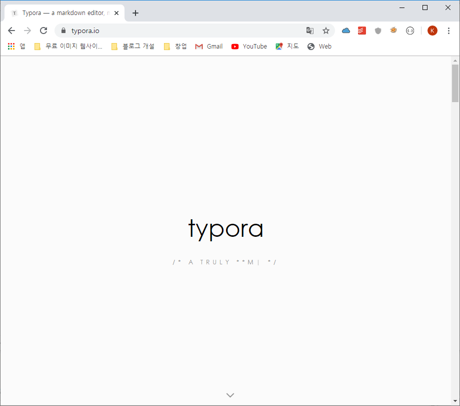

# 멀티캠퍼스 git hub 특강 1일차

**강사 :** 해피해킹 대표 김동주 강사님(멋쟁이 사자처럼 전 대표)

##  1. 4차 산업혁명 특징

저는 현재 멀티캠퍼스의 딥러닝 AI 엔지니어링 수업을 듣고 있습니다.

금일부터 배웠던 사항을 블로그에 올리려고 합니다.

### 4차 산업혁명이란 ? 

>  본격적으로 전 생활 영역에 소프트웨어를 활용하게 되는 것

다른 어려운 정의도 있지만, 이해하기 쉽게 4차 산업혁명을 잘 설명하는 정의인거 같습니다. 

몇 년전 현대카드 직원들은 정태영 사장님의 지시로 사장 및 임원 그리고 전직원들에게 파이썬 교육을 실시하였다고 합니다. 

화장실 이나 사내 식당 매뉴 들도 모두 프로그램으로 되어 있다고 하네요.ㅋㅋ

강사님이 굉장히 여러번에 걸쳐 강조했던 말이 있었습니다.

### 수레바퀴를 두번 만들지 마라

이미 잘 만들어진 프로그램을 최대한 활용하면서 내가 원하는 프로그램을 충분히 만들 수 있다는 의미입니다. 

최근에는 기술을 생산하는 집단과 활용하는 집단이 구분되고 있기 때문에 기술을 처음부터 만들 필요가 없다는 말입니다.  예를 들어, 이미  잘 만들어진 tensorflow와 같은 프레임워크를 사용하거나 AWS같은 플랫폼을 사용해서 다양한 인공지능 프로그램을 잘 만들 수 있다는 말이죠

**1) 구글텐서플로우 :** airbnb, Xiaomi

**2) AWS :** Pinterest, Netfix

**3) IBM Watson :** Legends, Minter Ellison(로펌 회사 로 관련 챗봇 프로그램 개발)

### 4차 산업혁명에 대한 여러 모습

[아마존에서 개발하고 있는 드론을 통한  배송 시스템](https://www.youtube.com/watch?v=LrTIOCK2fuM)

[bepro11](https://www.bepro11.com/main) [영상 촬영을 통해 선수들의 움직임 상태를 모니터링 할 수 있는 프로그램] 멋

### 데이터 사이언스를 공부할 수 있는 사이트

1.  cousera

2.  Edx- CS50

3. Udacity (udacity.com)

4.  K-MOOC

참고할 만한 유튜브 영상

# 2. git 및 Markdown 전용 문서 프로그램 설치

1.  git-scm.com사이트에서 git 2.24.1버전을 다운 받습니다.

****

2.  설치는 그냥 기본 디폴트로 쭉 설치하시면 됩니다.

3.  https://www.typora.io/ 에서 typora 프로그램을 설치합니다. 역시 기본 디폴트 값으로 설치하시면 됩니다. 

4. Typora에서 파일 > 환경설정 > 이미지에 들어가 다음과 같이 세팅합니다.

****

추가 적으로 마크다운 문법과 git 사용법을 배웠습니다. 

해당 내용은 다른 페이지에 개재하겠습니다.