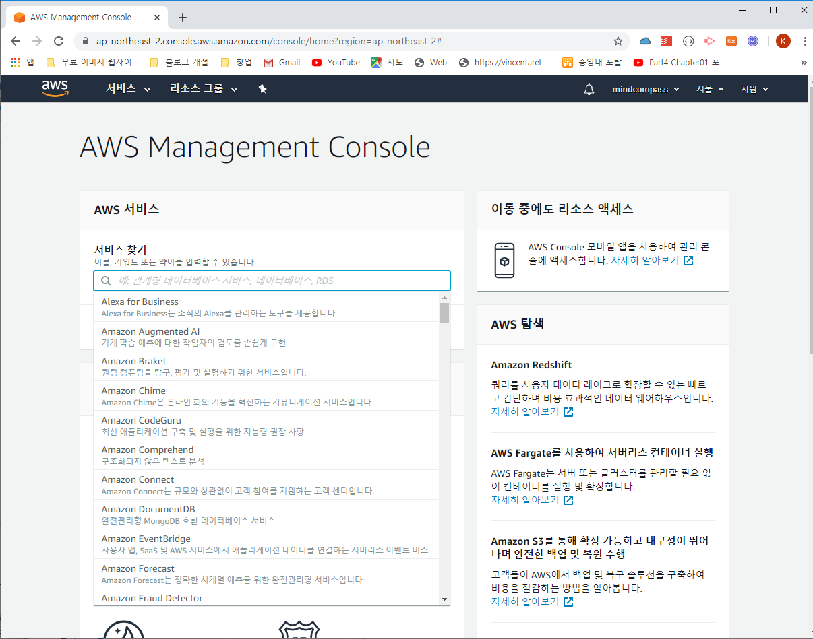
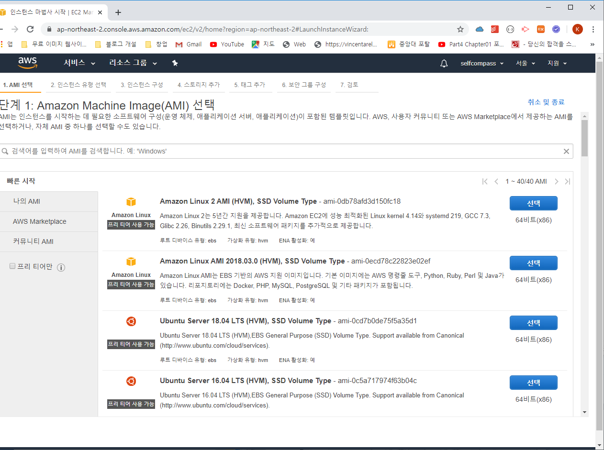
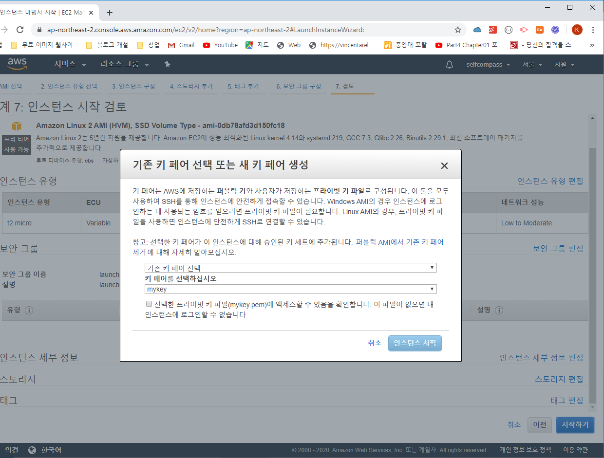
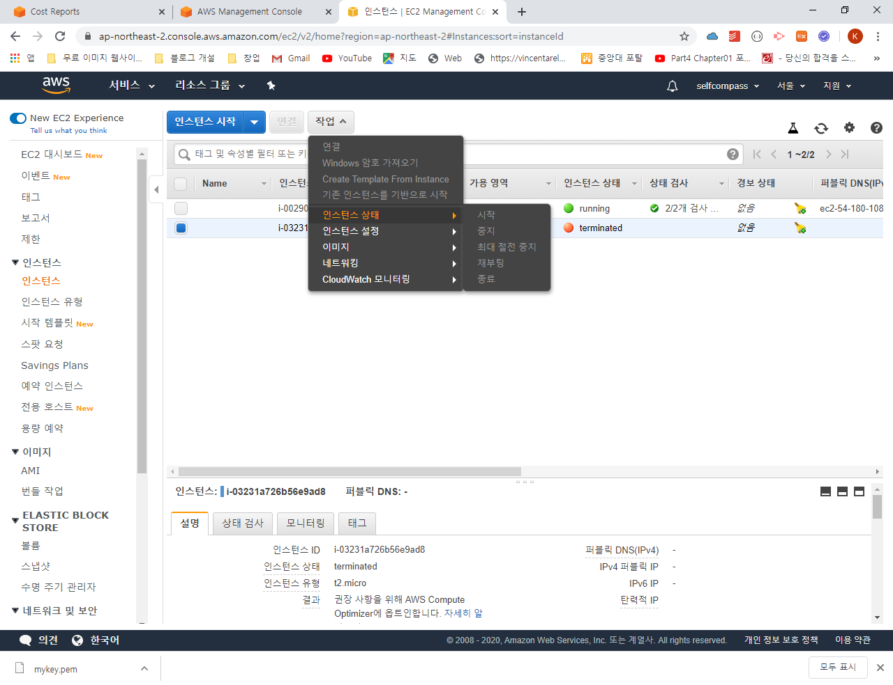
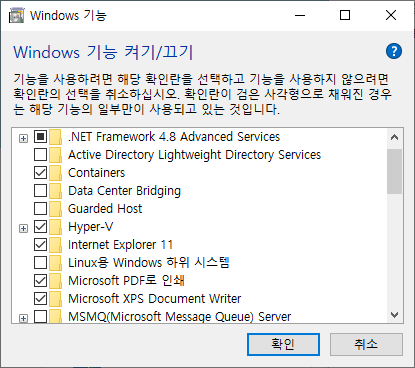

2020년 3월 23일 내용


객체 DB(몽고DB)는 비정형 데이터 처리에서 속도가 관계형 DB보다 빠르다.


google cloud platform

[레진코믹스사례](https://www.slideshare.net/curioe_/lezhincomics-google-appengine-30453946)


빅데이터 에포시스템


AWS 수행하기






아마존 리눅스(1번), 우분투 서버(3번) 실행함

아마존 리눅스에 기본으로 설치된 python은 2.7버전이기 때문에 재설치함

python3 설치함

```python
python

exit()

sudo yum install python3
```


인스턴스를 선택하고 연결방법을 선택함




키를 다운받은뒤 키페어를 선택함




인스턴스 상태에서 종료를 하면 중지 된 상태에서 1일 뒤에 실제 삭제됨


우분투 서버에서 내용을 

**SSH-Client** 다운로드


서버 이름을 보통 동물이름을 사용함 예) tiger

암호 없이 확인을 누름


### 3.도커 실습


도커 데스크탑 다운로드

get 도커에서 다운로드 수행


windows 기능 켜기/끄기

윈도우를 서버로 



버추얼박스 / HYPER  V  중 하나만 선택해야 함 


 HYPER  V를 확인하려면 windows 관리도구에서 확인함


docker 명령어 정리

```python
docker images # docker에 있는 images 내용 확인

docker pull ubuntu:18.04  # docker에 우분트를 설치

docker images #

docker run

docker rm (image)

docker ps -a 

docker run -it 4e /bin/bash
```


